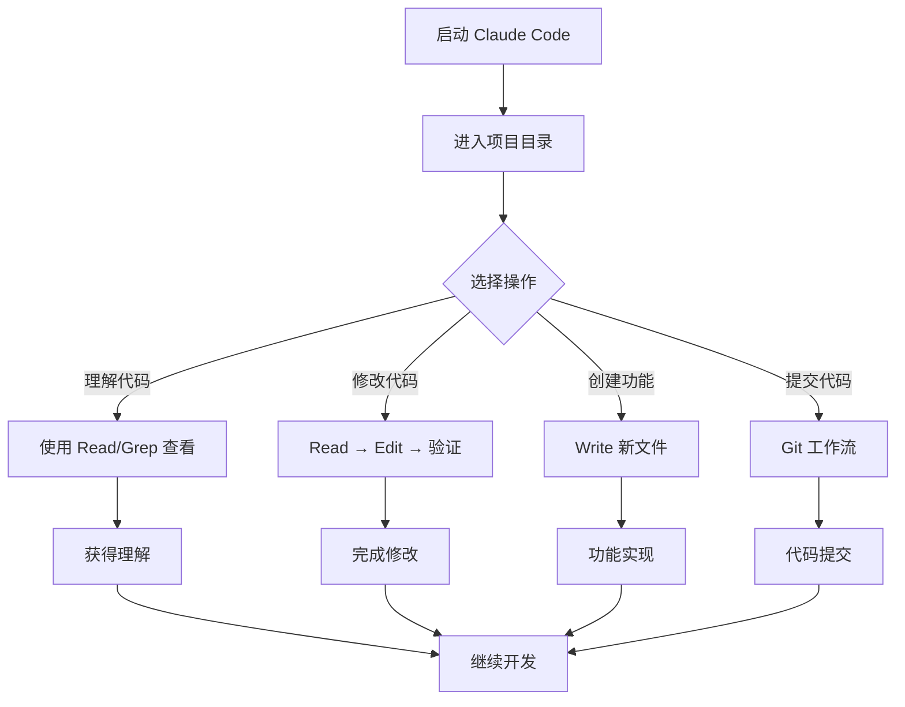
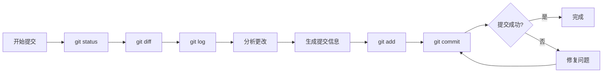
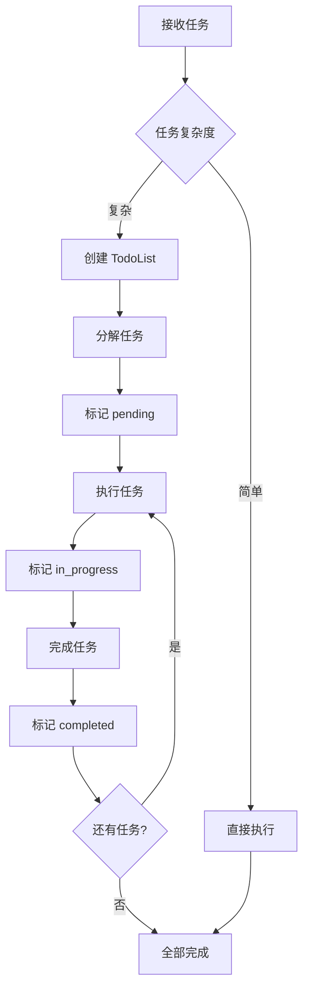
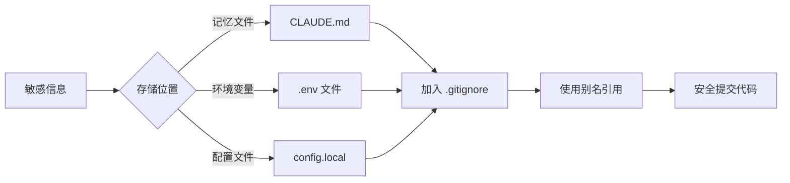
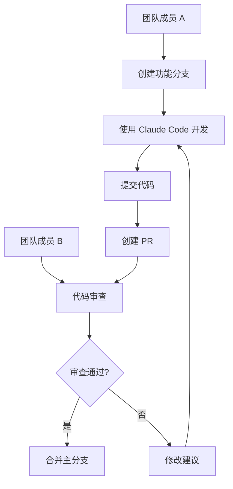

# Claude Code 中文使用指南与总结

## 一、快速概览

Claude Code 是 Anthropic 开发的终端AI编程助手，通过自然语言交互帮助开发者提高编码效率。

## 二、核心功能对比表

| 功能类别 | 具体功能 | 使用场景 | 优势特点 |
|---------|---------|---------|---------|
| **代码理解** | 项目结构分析 | 新项目熟悉 | 快速理解代码库 |
| | 代码解释 | 复杂逻辑理解 | 自然语言解释 |
| | 依赖分析 | 项目维护 | 自动识别依赖关系 |
| **代码编写** | 自动生成代码 | 新功能开发 | 减少重复工作 |
| | 代码修改 | Bug修复 | 精确定位修改 |
| | 代码重构 | 代码优化 | 保持功能一致性 |
| **版本控制** | Git操作 | 日常开发 | 自动化工作流 |
| | 提交管理 | 代码提交 | 智能生成提交信息 |
| | PR创建 | 协作开发 | 一键创建PR |
| **项目管理** | 任务跟踪 | 复杂任务 | TodoWrite工具 |
| | 文件操作 | 日常开发 | 批量处理 |
| | 搜索定位 | 代码查找 | 正则表达式支持 |

## 三、工具使用矩阵

| 工具名称 | 主要用途 | 使用频率 | 注意事项 |
|---------|---------|---------|---------|
| **Read** | 读取文件 | ⭐⭐⭐⭐⭐ | 修改前必须先读取 |
| **Write** | 创建文件 | ⭐⭐⭐ | 会覆盖已存在文件 |
| **Edit** | 编辑文件 | ⭐⭐⭐⭐⭐ | 需要精确匹配文本 |
| **MultiEdit** | 批量编辑 | ⭐⭐⭐⭐ | 效率高于多次Edit |
| **Bash** | 执行命令 | ⭐⭐⭐⭐⭐ | 支持后台运行 |
| **Grep** | 搜索内容 | ⭐⭐⭐⭐ | 使用ripgrep引擎 |
| **Glob** | 文件匹配 | ⭐⭐⭐ | 支持通配符 |
| **LS** | 列出目录 | ⭐⭐⭐ | 需要绝对路径 |
| **Task** | 代理任务 | ⭐⭐ | 复杂任务处理 |
| **TodoWrite** | 任务管理 | ⭐⭐⭐⭐ | 多步骤任务必用 |
| **WebFetch** | 获取网页 | ⭐⭐ | 可能需要代理 |
| **WebSearch** | 网络搜索 | ⭐⭐ | 获取最新信息 |

## 四、工作流程图

### 4.1 基础开发流程



### 4.2 Git 提交流程



### 4.3 任务管理流程



## 五、命令速查表

### 系统命令
| 命令 | 功能 | 示例 |
|------|------|------|
| `/help` | 获取帮助 | `/help` |
| `/bug` | 报告问题 | `/bug 发现了一个错误` |
| `/model` | 切换模型 | `/model opus` |
| `/settings` | 配置设置 | `/settings` |
| `/exit` | 退出程序 | `/exit` |

### 常用操作示例
```bash
# 1. 理解项目
"请分析这个项目的结构"
"解释 main.js 文件的功能"

# 2. 编写代码
"创建一个用户认证模块"
"添加错误处理到 API 调用"

# 3. 修复问题
"修复登录功能的 bug"
"优化数据库查询性能"

# 4. Git 操作
"提交我的更改"
"创建一个 PR"
```

## 六、配置最佳实践

### 6.1 项目初始化清单

- [ ] 创建 CLAUDE.md 记忆文件
- [ ] 配置 .claudeignore
- [ ] 设置 .gitignore
- [ ] 配置网络代理（如需要）
- [ ] 初始化 Git 仓库

### 6.2 CLAUDE.md 模板结构

```markdown
# 项目记忆文件

## 项目信息
- 项目名称
- 技术栈
- 主要功能

## 开发规范
- 代码风格
- 命名规则
- 提交规范

## 环境配置
- 开发环境
- 测试环境
- 生产环境

## 常用命令
- 构建命令
- 测试命令
- 部署命令

## 敏感信息（加入.gitignore）
- API密钥
- 数据库配置
- 服务器信息
```

## 七、性能优化技巧

### 7.1 批量操作优化

| 场景 | 低效方式 | 高效方式 |
|------|---------|---------|
| 多文件编辑 | 多次 Edit | 使用 MultiEdit |
| 多个搜索 | 顺序执行 | 并行执行 |
| 多个命令 | 分别运行 | 使用 `;` 或 `&&` 连接 |

### 7.2 搜索优化策略

1. **范围限定**: 指定搜索目录
2. **类型过滤**: 使用文件类型参数
3. **正则优化**: 使用精确的正则表达式
4. **缓存利用**: 重复访问使用缓存

## 八、故障排查指南

### 常见问题及解决方案

| 问题 | 可能原因 | 解决方案 |
|------|---------|---------|
| 无法连接外网 | 代理未配置 | 设置 HTTP_PROXY |
| 文件无法编辑 | 未先读取文件 | 先使用 Read 工具 |
| 命令执行失败 | 权限不足 | 检查文件权限 |
| 搜索无结果 | 路径错误 | 使用绝对路径 |
| Git 操作失败 | 配置问题 | 检查 git config |

## 九、安全注意事项

### 9.1 敏感信息处理



### 9.2 安全检查清单

- [ ] CLAUDE.md 已加入 .gitignore
- [ ] 敏感信息使用别名
- [ ] API 密钥未硬编码
- [ ] 数据库密码已加密
- [ ] 服务器信息已脱敏

## 十、进阶使用技巧

### 10.1 自定义工作流

1. **代码审查流程**
   ```
   分析代码 → 识别问题 → 提出建议 → 实施改进
   ```

2. **性能优化流程**
   ```
   性能分析 → 瓶颈定位 → 优化方案 → 实施测试
   ```

3. **重构流程**
   ```
   理解现有代码 → 设计新结构 → 渐进式重构 → 测试验证
   ```

### 10.2 提高效率的技巧

1. **明确具体的任务描述**
   - ❌ "优化代码"
   - ✅ "优化 getUserData 函数的数据库查询性能"

2. **提供上下文信息**
   - ❌ "添加验证"
   - ✅ "在用户注册表单添加邮箱格式验证"

3. **分步骤执行复杂任务**
   - 使用 TodoWrite 管理任务
   - 每完成一步立即标记
   - 保持专注单一任务

## 十一、集成开发环境

### IDE 集成方式

| IDE/编辑器 | 集成方式 | 优势 |
|-----------|---------|------|
| VS Code | 终端集成 | 无缝切换 |
| IntelliJ | Terminal 工具 | 统一界面 |
| Vim/Neovim | 终端分屏 | 高效操作 |
| Sublime Text | 构建系统 | 快捷键支持 |

## 十二、团队协作指南

### 12.1 团队规范建立

1. **统一 CLAUDE.md 格式**
2. **共享常用命令集**
3. **制定提交信息规范**
4. **建立代码审查流程**

### 12.2 协作工作流



## 十三、持续学习资源

- **官方文档**: 定期查看更新
- **社区论坛**: 交流使用经验
- **GitHub Issues**: 了解已知问题
- **Discord 群组**: 实时交流

## 总结

Claude Code 作为智能编程助手，通过自然语言交互大幅提升开发效率。掌握其核心功能、工具使用和最佳实践，能够显著改善开发体验。记住以下要点：

1. **先读后写**: 总是先理解代码再修改
2. **任务管理**: 复杂任务使用 TodoWrite
3. **安全第一**: 敏感信息妥善处理
4. **持续优化**: 不断改进使用方法

---

*本指南将持续更新，欢迎反馈和建议。*
*最后更新：2024年*