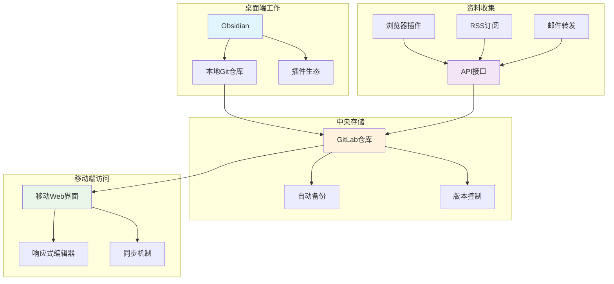
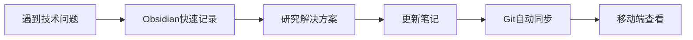
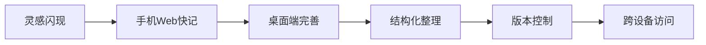

# 程序员&小说家全栈式Markdown笔记管理解决方案

## 🎯 需求分析

### 核心需求
- **主力工具**: Obsidian为核心的markdown笔记系统
- **备份存储**: 自建GitLab作为版本控制和备份
- **移动访问**: 手机友好的Web界面查看编辑
- **资料收集**: 多来源资料的自动化收集处理
- **双重身份**: 满足程序员技术笔记 + 小说创作需求

### 使用场景分析
1. **桌面端深度工作**: Obsidian + Git同步
2. **移动端快速记录**: Web界面编辑查看
3. **跨设备同步**: GitLab作为中心仓库
4. **资料整理**: 自动化收集和分类

---

## 🏗️ 系统架构设计



---

## 📱 完整解决方案

### 1️⃣ Obsidian核心配置

#### 基础文件夹结构
```
ObsidianVault/
├── 00-Inbox/              # 收件箱（新资料临时存放）
├── 01-Projects/           # 项目管理
│   ├── 编程项目/
│   └── 小说项目/
├── 02-Areas/             # 长期关注领域
│   ├── 技术学习/
│   ├── 写作技巧/
│   └── 行业资讯/
├── 03-Resources/         # 资源库
│   ├── 代码片段/
│   ├── 写作素材/
│   └── 参考资料/
├── 04-Archive/           # 归档
├── 99-Meta/             # 元数据
│   ├── Templates/       # 模板
│   ├── Scripts/         # 脚本
│   └── Settings/        # 配置
└── attachments/         # 附件
```

#### 核心插件配置

**必装插件列表**
```json
{
  "plugins": {
    "templater-obsidian": {
      "name": "Templater",
      "purpose": "动态模板系统",
      "config": "自动化笔记创建"
    },
    "obsidian-git": {
      "name": "Git",
      "purpose": "自动Git同步",
      "config": "每30分钟自动提交"
    },
    "dataview": {
      "name": "Dataview",
      "purpose": "数据查询展示",
      "config": "自动生成索引和统计"
    },
    "obsidian-kanban": {
      "name": "Kanban",
      "purpose": "项目管理看板",
      "config": "任务和进度跟踪"
    },
    "quickadd": {
      "name": "QuickAdd",
      "purpose": "快速添加内容",
      "config": "一键创建不同类型笔记"
    }
  }
}
```

**Git插件配置**
```json
{
  "commitMessage": "vault backup: {{date:YYYY-MM-DD HH:mm:ss}}",
  "autoCommitMessage": "auto-backup: {{hostname}} {{date}}",
  "commitDateFormat": "YYYY-MM-DD HH:mm:ss",
  "autoSaveInterval": 30,
  "autoPushInterval": 5,
  "pullBeforePush": true,
  "remoteName": "origin",
  "branchName": "main"
}
```

#### 程序员专用模板

**技术笔记模板**
```markdown
---
title: "{{title}}"
date: {{date:YYYY-MM-DD}}
tags: 
  - tech
  - {{folder}}
category: 技术笔记
status: 草稿
---

# {{title}}

## 问题描述
- 

## 解决方案
```{{language}}

```

## 相关链接
- 

## 总结
- 

## 下次行动
- [ ] 
```

**小说创作模板**
```markdown
---
title: "{{title}}"
date: {{date:YYYY-MM-DD}}
tags: 
  - novel
  - {{genre}}
category: 小说创作
word_count: 0
status: 构思中
---

# {{title}}

## 剧情大纲
- 

## 人物设定
### 主角
- **姓名**: 
- **性格**: 
- **背景**: 

## 场景描述
- 

## 情节要点
1. 
2. 
3. 

## 写作进度
- [ ] 大纲完成
- [ ] 初稿完成
- [ ] 一校完成
- [ ] 定稿完成

## 字数统计
当前字数: {{word_count}}
目标字数: 

## 备注
- 
```

### 2️⃣ 移动端Web解决方案

#### 方案选择：Obsidian Publish + 自定义前端

**方案A: 基于Foam + Next.js**
```bash
# 项目结构
obsidian-web/
├── frontend/              # Next.js前端
│   ├── components/
│   │   ├── Editor/       # Markdown编辑器
│   │   ├── FileTree/     # 文件树
│   │   └── Mobile/       # 移动端组件
│   ├── pages/
│   ├── styles/
│   └── utils/
├── backend/              # Node.js后端
│   ├── api/             # RESTful API
│   ├── git/             # Git操作
│   └── sync/            # 同步逻辑
└── mobile/              # PWA配置
```

**核心技术栈**
- **前端**: Next.js + TailwindCSS + Monaco Editor
- **后端**: Node.js + Express + Simple-git
- **数据库**: SQLite (索引和缓存)
- **认证**: JWT + 双因子认证
- **PWA**: Service Worker + 离线缓存

#### 移动端优化配置

**响应式设计**
```css
/* mobile-first设计 */
.editor-container {
  /* 手机端 */
  @apply w-full h-screen p-2;
}

@media (min-width: 768px) {
  .editor-container {
    /* 平板端 */
    @apply p-4 max-w-4xl mx-auto;
  }
}

@media (min-width: 1024px) {
  .editor-container {
    /* 桌面端 */
    @apply flex gap-4;
  }
}

/* 移动端编辑器优化 */
.mobile-editor {
  font-size: 16px; /* 防止iOS缩放 */
  line-height: 1.5;
  padding: 1rem;
}

.mobile-toolbar {
  position: fixed;
  bottom: 0;
  left: 0;
  right: 0;
  background: white;
  border-top: 1px solid #e5e7eb;
}
```

**PWA配置**
```json
{
  "name": "Obsidian Mobile",
  "short_name": "ObsidianM",
  "description": "移动端Obsidian笔记管理",
  "start_url": "/",
  "display": "standalone",
  "background_color": "#ffffff",
  "theme_color": "#1e40af",
  "icons": [
    {
      "src": "/icons/icon-192x192.png",
      "sizes": "192x192",
      "type": "image/png"
    },
    {
      "src": "/icons/icon-512x512.png",
      "sizes": "512x512",
      "type": "image/png"
    }
  ]
}
```

### 3️⃣ GitLab集成方案

#### GitLab CI/CD配置
```yaml
# .gitlab-ci.yml
stages:
  - sync
  - build
  - deploy

variables:
  NODE_VERSION: "18"

sync_vault:
  stage: sync
  script:
    - git pull origin main
    - npm run sync-check
    - npm run generate-index
  rules:
    - if: $CI_COMMIT_BRANCH == "main"
      changes:
        - "**/*.md"

build_web:
  stage: build
  image: node:18
  script:
    - npm install
    - npm run build
  artifacts:
    paths:
      - dist/
    expire_in: 1 hour
  only:
    - main

deploy_web:
  stage: deploy
  script:
    - rsync -av dist/ /var/www/obsidian-web/
    - systemctl reload nginx
  only:
    - main
```

#### GitLab Webhooks配置
```javascript
// webhook处理器
const express = require('express');
const { execSync } = require('child_process');

app.post('/webhook/gitlab', (req, res) => {
  const payload = req.body;
  
  if (payload.object_kind === 'push') {
    // 检测到推送，触发同步
    try {
      execSync('cd /path/to/vault && git pull');
      execSync('npm run rebuild-index');
      
      // 通知前端更新
      io.emit('vault-updated', {
        timestamp: new Date(),
        changes: payload.commits.length
      });
      
      res.status(200).json({ status: 'success' });
    } catch (error) {
      res.status(500).json({ error: error.message });
    }
  }
});
```

### 4️⃣ 资料收集自动化系统

#### 多渠道收集方案

**浏览器插件 (Web Clipper)**
```javascript
// content.js - Chrome扩展
class ObsidianClipper {
  constructor() {
    this.apiEndpoint = 'https://your-domain.com/api/clip';
  }
  
  async clipPage() {
    const pageData = {
      title: document.title,
      url: window.location.href,
      content: this.getMainContent(),
      tags: this.extractTags(),
      timestamp: new Date().toISOString(),
      domain: window.location.hostname
    };
    
    return this.sendToObsidian(pageData);
  }
  
  getMainContent() {
    // 智能提取主要内容
    const article = document.querySelector('article') || 
                   document.querySelector('.content') ||
                   document.querySelector('main');
    
    if (article) {
      return this.htmlToMarkdown(article.innerHTML);
    }
    
    // 备用方案：提取所有段落
    const paragraphs = document.querySelectorAll('p');
    return Array.from(paragraphs)
      .map(p => p.textContent)
      .filter(text => text.length > 50)
      .join('\n\n');
  }
  
  htmlToMarkdown(html) {
    // 简化的HTML到Markdown转换
    return html
      .replace(/<h([1-6])>/g, (match, level) => '#'.repeat(parseInt(level)) + ' ')
      .replace(/<\/h[1-6]>/g, '\n\n')
      .replace(/<strong>|<b>/g, '**')
      .replace(/<\/strong>|<\/b>/g, '**')
      .replace(/<em>|<i>/g, '*')
      .replace(/<\/em>|<\/i>/g, '*')
      .replace(/<code>/g, '`')
      .replace(/<\/code>/g, '`')
      .replace(/<pre>/g, '```\n')
      .replace(/<\/pre>/g, '\n```')
      .replace(/<[^>]*>/g, ''); // 移除其他HTML标签
  }
}
```

**RSS订阅处理**
```javascript
// rss-processor.js
const Parser = require('rss-parser');
const parser = new Parser();

class RSSProcessor {
  constructor() {
    this.feeds = [
      'https://feeds.example.com/tech',
      'https://feeds.example.com/writing'
    ];
  }
  
  async processFeed(feedUrl) {
    const feed = await parser.parseURL(feedUrl);
    
    for (const item of feed.items) {
      if (this.isInteresting(item)) {
        await this.createNote({
          title: item.title,
          content: item.content || item.summary,
          link: item.link,
          pubDate: item.pubDate,
          categories: item.categories || [],
          source: feed.title
        });
      }
    }
  }
  
  isInteresting(item) {
    const keywords = ['JavaScript', 'Node.js', '写作', '小说', 'AI'];
    const content = (item.title + ' ' + item.summary).toLowerCase();
    
    return keywords.some(keyword => 
      content.includes(keyword.toLowerCase())
    );
  }
  
  async createNote(data) {
    const template = `---
title: "${data.title}"
source: "${data.source}"
link: ${data.link}
date: ${data.pubDate}
tags: ${data.categories.map(c => `"${c}"`).join(', ')}
type: RSS订阅
---

# ${data.title}

> 来源: [${data.source}](${data.link})
> 发布时间: ${data.pubDate}

${data.content}

## 个人笔记
- 

## 相关链接
- [原文链接](${data.link})
`;
    
    // 保存到Obsidian Inbox
    await this.saveToVault('00-Inbox', template);
  }
}
```

**邮件转发系统**
```python
# email_processor.py
import imaplib
import email
from email.mime.text import MIMEText
import markdown

class EmailToObsidian:
    def __init__(self):
        self.imap_server = 'imap.gmail.com'
        self.username = 'your-email@gmail.com'
        self.password = 'app-password'
        
    def process_emails(self):
        """处理标记为转发的邮件"""
        mail = imaplib.IMAP4_SSL(self.imap_server)
        mail.login(self.username, self.password)
        mail.select('inbox')
        
        # 搜索带有特定标签的邮件
        status, messages = mail.search(None, 'SUBJECT "To-Obsidian"')
        
        for msg_id in messages[0].split():
            status, msg_data = mail.fetch(msg_id, '(RFC822)')
            email_msg = email.message_from_bytes(msg_data[0][1])
            
            note_content = self.extract_content(email_msg)
            self.create_note(note_content)
            
            # 标记邮件为已处理
            mail.store(msg_id, '+FLAGS', '\\Deleted')
        
        mail.expunge()
        mail.close()
        mail.logout()
    
    def extract_content(self, email_msg):
        """从邮件中提取内容"""
        subject = email_msg['subject']
        sender = email_msg['from']
        date = email_msg['date']
        
        body = ""
        if email_msg.is_multipart():
            for part in email_msg.walk():
                if part.get_content_type() == "text/plain":
                    body = part.get_payload(decode=True).decode()
                    break
        else:
            body = email_msg.get_payload(decode=True).decode()
        
        return {
            'title': subject,
            'sender': sender,
            'date': date,
            'content': body
        }
```

### 5️⃣ 部署与配置

#### Docker化部署
```yaml
# docker-compose.yml
version: '3.8'

services:
  obsidian-web:
    build: .
    ports:
      - "3000:3000"
    environment:
      - NODE_ENV=production
      - GITLAB_URL=https://gitlab.yourdomain.com
      - VAULT_PATH=/app/vault
    volumes:
      - ./vault:/app/vault
      - ./config:/app/config
    depends_on:
      - redis
  
  redis:
    image: redis:alpine
    volumes:
      - redis_data:/data
  
  nginx:
    image: nginx:alpine
    ports:
      - "80:80"
      - "443:443"
    volumes:
      - ./nginx.conf:/etc/nginx/nginx.conf
      - ./ssl:/etc/nginx/ssl
    depends_on:
      - obsidian-web

volumes:
  redis_data:
```

#### 自动化脚本
```bash
#!/bin/bash
# setup-obsidian-system.sh

echo "🚀 设置Obsidian全栈笔记系统..."

# 1. 创建项目结构
mkdir -p {vault,web-frontend,automation,config}

# 2. 初始化Git仓库
cd vault
git init
git remote add origin https://gitlab.yourdomain.com/your-username/obsidian-vault.git

# 3. 安装依赖
cd ../web-frontend
npm install next react react-dom tailwindcss monaco-editor

# 4. 配置GitLab CI/CD
cp ../config/gitlab-ci.yml ./.gitlab-ci.yml

# 5. 设置自动化任务
cd ../automation
pip install -r requirements.txt

# 6. 配置系统服务
sudo systemctl enable obsidian-web
sudo systemctl start obsidian-web

echo "✅ 系统配置完成！"
echo "📱 Web访问: https://yourdomain.com"
echo "📖 Obsidian: 连接到Git仓库开始使用"
```

---

## 🎯 使用工作流

### 日常工作流程

**程序员模式**


**小说家模式**


### 高效技巧

**快捷操作配置**
```json
{
  "hotkeys": {
    "新建技术笔记": "Ctrl+Shift+T",
    "新建小说笔记": "Ctrl+Shift+N", 
    "快速收集": "Ctrl+Shift+C",
    "同步Git": "Ctrl+Shift+G",
    "移动预览": "Ctrl+Shift+M"
  }
}
```

**自动化规则**
```javascript
// 自动分类规则
const autoClassifyNote = (note) => {
  const content = note.content.toLowerCase();
  
  if (content.includes('function') || content.includes('class')) {
    return '01-Projects/编程项目';
  } else if (content.includes('人物') || content.includes('剧情')) {
    return '01-Projects/小说项目';
  } else if (content.includes('学习') || content.includes('教程')) {
    return '02-Areas/技术学习';
  } else {
    return '00-Inbox';
  }
};
```

---

## 📊 系统监控与维护

### 监控仪表盘
- **笔记数量统计**: 按类型和时间分析
- **同步状态监控**: Git操作成功率
- **移动端使用**: 访问频率和性能
- **存储空间**: 附件和图片使用情况

### 备份策略
- **本地备份**: 每日自动备份到外部存储
- **云端备份**: GitLab + 腾讯云COS双重保险
- **增量备份**: 只备份变更内容，节省空间
- **版本恢复**: 支持任意时间点恢复

---

## 💡 进阶优化

### AI增强功能
- **智能标签**: 自动为笔记打标签
- **内容摘要**: AI生成笔记摘要
- **相关推荐**: 基于内容推荐相关笔记
- **写作助手**: 小说创作的AI建议

### 团队协作功能
- **多人编辑**: 支持多人同时编辑不同文件
- **评论系统**: 支持笔记评论和讨论
- **权限管理**: 不同用户不同访问权限
- **变更通知**: 内容变更邮件/微信通知

这套解决方案完美融合了你的双重身份需求，既满足程序员的技术笔记管理，又支持小说家的创作流程。通过Obsidian的强大功能加上自定义的移动端Web界面，你可以在任何地方、任何设备上高效地管理你的知识库！🚀